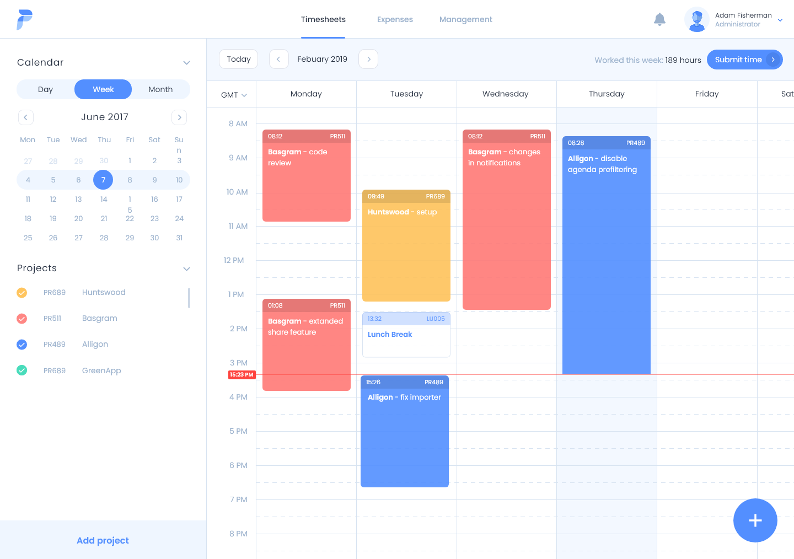

<!-- omit in toc -->
# To-dos

- [Features](#features)
  - [Milestones 🚩](#milestones-)
  - [Main Window](#main-window)
  - [Work Items / Tasks](#work-items--tasks)
  - [Weekly Overview](#weekly-overview)
  - [Calender](#calender)
  - [Options](#options)
  - [Integration](#integration)
- [Bugs](#bugs)
- [General Improvements](#general-improvements)

**Design**

## Features

**MuSCoW - (M)ust, (S)hould, (C)ould, (W)ont**

### Milestones 🚩

- [ ] Calender view
- [ ] Week view with times being rendered

### Main Window

- [x] Save Window Location and size

### Work Items / Tasks

- [X] (M) Start new task
- [ ] (M) Change activity from context menu
  - [ ] (S) Activity colors
  - [ ] (C) Change activity colors in Options
- [ ] (M) By starting new task, old task has to end
- [ ] (M) Refresh of overview on task change
- [ ] (S) Work Item / Tasks Management
  - [ ] (S) Add
  - [ ] (S) Remove
  - [ ] (S) Edit
  - [ ] (C) Sub-tasks
  - [ ] (C) Keyboard shortcuts
- [ ] (S) Belated entry of task
  - [ ] (C) Rerender of overview

### Weekly Overview

- [x] (M) Load data from Database
  - [x] (M) Load data only for specific date
- [ ] (M) Simple view for data
  - [ ] (S) Extended view for data (see screenshot)
- [ ] (S) Auto refresh on date change

### Calender

- [ ] (M) Calender view in sidebar
- [ ] (M) Selected date to overview
- [ ] (S) Month and year selection
- [ ] (C) Grey out not available datasets

### Options

- [ ] (C) Set default activity

### Integration

- [ ] (C) ICal support for meeting import
- [ ] (C) Plug-in based import of Work Items
- [ ] (C) Plug-in based export of sheets
- [ ] (C) Plug-in based export integration to other systems

## Bugs

## General Improvements

- [ ] To much business logic in `WorkTask` Value Type?
- [ ] Refactor Mapping Domain to Entity using `Mapster`
- [ ] `ICommandHandler` generic `Get` with selection